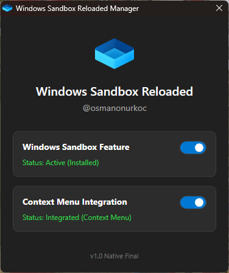

# 🛡️ Windows Sandbox Reloaded

A powerful, modern GUI manager for Windows Sandbox. Enable or disable the sandbox feature with a single click and integrate **"Open in Sandbox (Read-Only)"** directly into your right-click context menu for safe testing.

## 📸 Overview

*Testing suspicious files shouldn't be complicated.*

Windows Sandbox is a fantastic feature, but mounting folders usually requires manually creating `.wsb` configuration files. **Windows Sandbox Reloaded** solves this by automating the process via the Context Menu.

## 📸 Screenshots

  
  

## ✨ Key Features

* **🚀 One-Click Toggle:** Enable or Disable the "Windows Sandbox" optional feature without digging through the Control Panel.
* **🖱️ Context Menu Integration:** Adds a right-click option to your File Explorer background.
    * **Action:** Instantly mounts the *current folder* into a fresh Sandbox instance.
    * **Mode:** **Read-Only**. The sandbox cannot modify, encrypt, or delete your original files. Perfect for malware analysis.
* **🎨 Modern UI & Theme Engine:** Automatically detects your Windows System Theme (Dark/Light Mode) and adjusts the interface in real-time.
* **🔒 Safe Execution:** The tool uses native PowerShell and Windows API calls. No external binaries or DLLs are required.

## 🚀 Getting Started

### Prerequisites
* **OS:** Windows 10 Pro/Enterprise or Windows 11 Pro/Enterprise.
* **Virtualization:** Must be enabled in BIOS.

### Installation & Usage

1. Download the latest `Windows_Sandbox_Reloaded.ps1` from the **[Releases Page](https://github.com/osmanonurkoc/Windows_Sandbox_Reloaded/releases/latest)**.
2. Right-click the file and select **Run with PowerShell**.
   * *Note:* Requires **Administrator** privileges to enable features and modify the Registry.
3. Use the switches to enable the Sandbox Feature or the Context Menu integration.

## 🛠️ How It Works

### Context Menu Integration
When you click "Open in Sandbox (Read-Only)":
1. The tool generates a temporary `.wsb` (Windows Sandbox Configuration) file.
2. It maps the host folder to the Sandbox desktop.
3. It sets `ReadOnly="true"` to protect your host data.
4. It launches Windows Sandbox with this configuration.

## ⚠️ Disclaimer
While this tool mounts folders in **Read-Only** mode to protect your files from modification (e.g., Ransomware encryption), **network access is enabled by default** in Windows Sandbox. 
- Always exercise caution when running unknown software.

## 📄 License
This project is licensed under the [MIT License](LICENSE).

---
*Created by [@osmanonurkoc](https://github.com/osmanonurkoc)*
